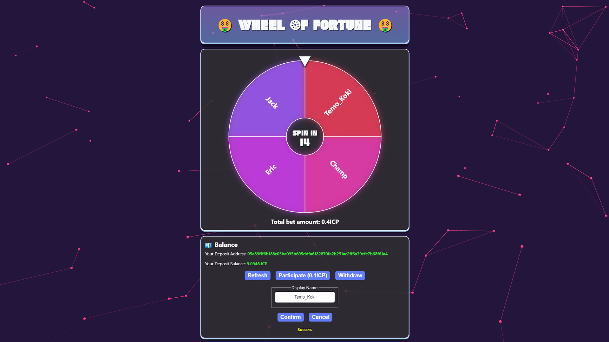

# IC_Wheel_of_Fortune

Simple wheel of fortune game with Internet Identity authentication integration and ICP coin transferring functionality via Ledger canister.
<br>Players are charged 0.1 ICP to participate in game. The  winner is chosen randomly and gets 100% of betted amount of ICP - 0.0001ICP (IC ledger's standard fee)
<br>Backend is written in Motoko, frontend is built using React/JSX.
<br>Game demo canister: [https://vu6th-iyaaa-aaaan-qlw2a-cai.icp0.io](https://vu6th-iyaaa-aaaan-qlw2a-cai.icp0.io)

<p align="center"></p>

## Prerequisites 

This example requires an installation of [IC SDK](https://internetcomputer.org/docs/current/developer-docs/setup/install/index.mdx) and [Node.js](https://nodejs.org/en/download/)

## Running the project locally

- To test project locally, open terminal window and navigate into the folder containing project's files
- Use the following commands:

```bash
# Installs necessary node modules
npm install

# Starts the local replica in background
dfx start --background --clean

# Creates new identity for minting account and exports its ID as "MINTER_ACCOUNT_ID" variable
dfx identity new minter --storage-mode=plaintext
dfx identity use minter
export MINTER_ACCOUNT_ID=$(dfx ledger account-id)

# Exports default identity's account ID as "DEFAULT_ACCOUNT_ID" variable
dfx identity use default
export DEFAULT_ACCOUNT_ID=$(dfx ledger account-id)

# Deploys ledger canister with archiving options enabled
dfx deploy --specified-id ryjl3-tyaaa-aaaaa-aaaba-cai icp_ledger --argument "
  (variant {
    Init = record {
      minting_account = \"$MINTER_ACCOUNT_ID\";
      initial_values = vec {
        record {
          \"$DEFAULT_ACCOUNT_ID\";
          record {
            e8s = 100_000_000_000 : nat64;
          };
        };
      };
      send_whitelist = vec {};
      transfer_fee = opt record {
        e8s = 10_000 : nat64;
      };
      token_symbol = opt \"LICP\";
      token_name = opt \"Local ICP\";
    }
  })
"

# Deploys canisters to the replica and generates candid interface
dfx deploy

# Starts a development server at  http://localhost:8080 proxying API requests to the replica at port 4943
npm start

# For local testing, you should login in game with multiple identity and transfer some LICP to their accounts to be able to participate in game)
# Transfers 10 LICP to specified account address
dfx canister call icp_ledger send_dfx '(record{to="paste_your_deposit_address_here"; memo=0; fee=record{e8s=10_000}; amount=record{e8s=10_00_000_000};})'
```
